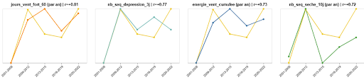
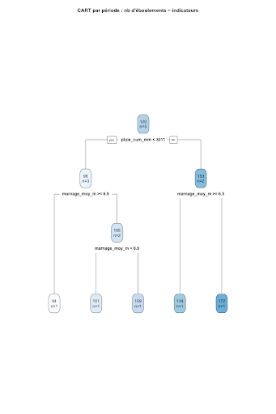
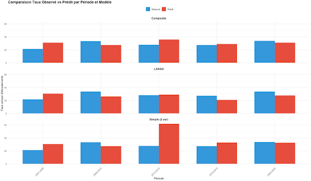

# Statistical Analysis & Modeling of Cliff Collapses in Normandy 

> **Project Goal:** Understand and model the meteorological and marine factors triggering cliff collapses (rockfalls) along the Seine-Maritime coast using statistical learning.

---

## Context & Objectives

This project was conducted as part of the engineering curriculum at **IMT Atlantique** (Projet Commande Entreprise), in partnership with the **Laboratoire LETG** (Littoral, Environnement, Télédétection, Géomatique - UMR 6554 CNRS) of the University of Western Brittany (UBO).

The Normandy chalk cliffs (Seine-Maritime) are subject to rapid retreat through frequent rockfalls. The scientific objective is to distinguish the role of **structural predisposition** (lithology, fracturing) from **meteo-marine triggering factors** (waves, rain, frost) in these erosion dynamics.

The study focuses on the coastline between **Cap d'Antifer and Le Tréport**, analyzing a dataset of **693 cliff collapses** digitized from IGN orthophotographs across six specific years (2000, 2008, 2012, 2015, 2019, 2022).

Our mission was to process this raw data to explain the variability of collapses across **6 hydro-sedimentary sub-cells** and different time periods.

**The Challenge:**
Identify which variables (rain, waves, tides, geology) best explain the frequency of collapses across:
1.  **Time:** Quels sont les indicateurs temporels qui expliquent le plus le nombre d'éboulement?
2.  **Space:** Quels sont les indicateurs spatiaux qui expliquent le plus le nombre d'éboulement?

---

## Methodology

We built a complete data pipeline from raw sources to predictive models:

| Step | Description | Tools |
| :--- | :--- | :--- |
| **1. Collection** | Aggregating data from SHOM (tides), Météo-France, CANDHIS (waves), and IGN. | Python |
| **2. Processing** | Cleaning and computing **72 indicators** (e.g., Cumulative wave energy, Freeze-thaw cycles).  | Python / QGIS |
| **3. Analysis** | Correlation matrices, Poisson regression, Negative Binomial, and CART Trees.  | R / Python |
| **4. Validation** | Leave-One-Out Cross-Validation (LOOCV) due to small sample size.  | R |

---

## Database Structure

The dataset aggregates **72 environmental indicators** crossed with **693 cliff collapse events** observed between 2000 and 2022 along the Seine-Maritime coast.

The data is structured into two main CSV/Excel files located in `data/processed/`:

### 1. `indicateurs_pour_R.csv` (Temporal Analysis)
This dataset is designed for time-series analysis (Poisson, ARIMA).
* **Rows:** 5 temporal periods (2001-2008, 2009-2012, etc.).
* **Columns:** 70+ variables including aggregated weather and marine data.
* **Key variables:** `pluie_cum_mm`, `jours_gel`, `energie_houle_cumulee`, `marnage_max`.

### 2. `indicateurs_par_cellule.csv` (Spatial Analysis)
This dataset focuses on the structural characteristics of the 6 hydro-sedimentary sub-cells.
* **Rows:** 6 spatial units (e.g., Cap d'Antifer to Fécamp).
* **Columns:** Geological and morphological indicators.
* **Key variables:** `taux_recul_m_an` (retreat rate), `lithologie_campanien_%`, `densite_fracturation`.

---

### Indicator Families
The features are grouped into 6 categories covering all physical drivers:

| Category | Description | Examples |
| :--- | :--- | :--- |
| **Sea State** | Wave energy and dynamics | `hs_max` (max wave height), `energie_cumulee` |
| **Tides** | Tidal range and cycles | `marnage_moy`, `jours_marnage_>8m` |
| **Weather** | Atmospheric forcing | `pluie_cum` (rain), `jours_gel_degel` (freeze-thaw) |
| **Lithology** | Rock composition | `cenomanien_%` (chalk type), `santonien_%` |
| **Morphology** | Cliff structure | `taux_de_recul`, `pente_falaise` |
| **Extremes** | Storm events | `surcote` (storm surge), `run_up_max` |

> ℹ️ *For detailed definitions, units, and calculation methods, please refer to the full documentation: [`docs/Indicateurs_explications.pdf`](docs/Indicateurs_explications.pdf).*

---
## Results & Conclusions

### 1. Correlation Analysis 
We identified strong correlations between collapse rates and storm-related indicators.

Strong positive correlation ($r \approx 0.8$) found with days of strong wind (>60 km/h) and cumulative wind energy.*

### 2. Decision Trees (CART Method)
To understand threshold effects, we used Classification and Regression Trees.

*The model highlights that **cumulative rainfall** (> 3000mm) and **tidal range** are the primary splitters for high-risk periods.*

Despite the challenge of a small dataset ($n=5$ periods, $n=6$ cells), we established robust findings:

### Model Performance & Machine Learning

**Objective:** Predict the annual rate of cliff collapses despite a critical data shortage ($n=5$ temporal periods). We evaluated three modeling approaches using **Leave-One-Out Cross-Validation (LOOCV)** to assess out-of-sample performance .

*(Figure: LOOCV Validation results. **Blue bars** = Observed rates; **Red bars** = Predicted rates on the left-out period.)*

#### 1. Studied Models
* **LASSO (Poisson + L1 Penalty):** Automatically selects important variables. While theoretically useful for high-dimensional data, it proved **highly unstable** and sensitive to the small sample size ($n=5$) .
* **Simple Model (2 variables):** Uses two strong predictors with low inter-correlation. While robust and interpretable, it lacks the complexity to handle atypical periods, leading to large errors in some cases .
* **Composite Model (Score-based):** Aggregates the most correlated variables into a single "risk score" before applying a Poisson regression. This approach proved to be the **most stable**, providing predictions close to observations while minimizing overfitting .

#### Critical Limitations & Statistical Uncertainty
Despite the coherence of the Composite Model, the results must be interpreted with caution due to the dataset size ($n=5$ periods, $n=6$ cells):
* **High Uncertainty:** Small changes in the input data can significantly alter the selected models and predictions (low reproducibility).
* **Unstable Correlations:** Relationships between variables vary significantly depending on the period included or excluded.
* **Overfitting Risk:** There is a persistent risk of the model "memorizing" the data rather than generalizing patterns.

> **Conclusion:** The results identify robust physical trends but remain **indicative**. The Composite Model offers the best trade-off between stability and accuracy for this specific constrained dataset.

---

## Future Roadmap & Perspectives

To improve prediction accuracy and operational utility, we identified three key development axes:

### 1. Advanced Modeling Techniques
* **Complex Algorithms:** Move beyond simple regressions by testing **GAM** (Generalized Additive Models) and **ARIMA** for time-series analysis.
* **Ensemble Learning:** Implement **Random Forest**, **XGBoost**, and **Gradient Boosting** to capture non-linear relationships, provided a larger dataset is available.
* **Lagged Features:** Investigate "memory effects" by modeling if meteorological events from the *previous* period ($t-1$) trigger collapses in the current one ($t$).

### 2. Data Enrichment
* **Exogenous Variables:** Integrate broader climatic indices (**NAO** - North Atlantic Oscillation, **AO**) and offshore swell data to capture large-scale atmospheric forcing.
* **Seasonality:** Downscale the temporal mesh from multi-year periods to a **seasonal scale** to better capture distinct winter/summer erosion patterns.

### 3. Operational Tools for Risk Management
* **Diagnostic Tool:** Develop an automatic alert system based on the critical thresholds identified by our CART analysis (e.g., Cumulative Rain > 3000mm & High Tidal Range).
* [**Dynamic Mapping:** Create **dynamic probability maps** to visualize rockfall risks in real-time based on incoming weather forecast.
---
## Authors

This project was carried out by **Group 7** from the Engineering program at **IMT Atlantique** (Brest, France), as part of the "Commande Entreprise" semester project (2025-2026).

* **Paul Trassaert**
* **Thomas de Saint Savin**
* **Laly Aubriet**
* **Anderson Adarve**
* **Mateo Giraldo**
* **Ginger Nguengoue Watcho**

---

## Acknowledgments

We would like to express our gratitude to the **Laboratoire LETG (UMR 6554 CNRS)** and the **Institut Universitaire Européen de la Mer (IUEM)** for trusting us with this study.

We specifically thank our supervisors and mentors for their guidance and scientific expertise throughout the project:

* **Pauline Letortu** (Maître de conférences, LETG) & **Antoine Le Doeuff** for their project oversight and geographical expertise.
* **Laurence Reboul** (Statistician) for her valuable advice on the selection of statistical models (Poisson/Negative Binomial).
* **Frédéric Audart** for his support.
* **Sébastien Houcke** (IMT Atlantique) for his pedagogical supervision.
